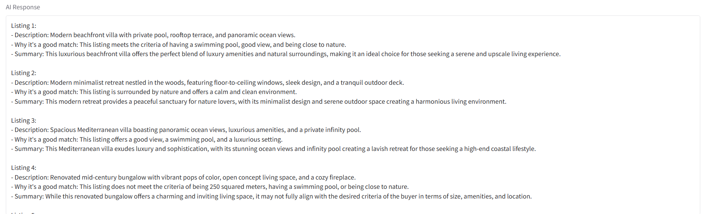

# 🏡 Personalized Real Estate Agent

A showcase project built as part of the **Generative AI Nanodegree by Udacity**. This intelligent real estate agent uses generative AI to create, process, and recommend real estate listings tailored to users' preferences.

---

## ✨ Project Overview

This project demonstrates the power of combining **LangChain**, **OpenAI**, and **LanceDB** to build a personalized real estate platform. Here's what it does:

- 🏘️ **Generates 100 diverse house listings** using `ChatOpenAI` from `langchain`.
- 🧠 **Converts these listings to embeddings** using `OpenAIEmbeddings`.
- 💾 **Stores them in a LanceDB vector database** for fast semantic search.
- 🖼️ **Fetches and embeds house images** from a public dataset.
- 📂 **Stores both text and image embeddings** in the same LanceDB table.
- 💻 **Provides a simple web interface** to explore listings.

---

## 📦 Installation & Usage

### 1. Clone the repository

```bash
git clone https://github.com/DiaeddinTahboub/Personalized-Real-Estate-Agent.git
cd Personalized-Real-Estate-Agent
```

### 2. Install requirements

```bash
pip install -r requirements.txt
```

### 3. Add your OpenAI API key

Create a `.env` file in the root directory and add:

```env
OPENAI_API_KEY=your_openai_api_key
```

### 4. Download the dataset

Download the house image dataset from Kaggle:

📥 [House Thumbnail Dataset](https://www.kaggle.com/datasets/ramiromep/house-thumbnail)

Unzip it into a folder named `images` inside the project directory (the `images` folder should contain all the images, make sure to cut them from the `combined` folder, paste them into the `images` folder, and delete the `combined` folder).

### 5. Run the setup script

```bash
python setup.py
```

This will:
- Generate listings
- Create embeddings
- Store them in LanceDB

### 6. Launch the website

```bash
python website.py
```

---

## 🌟 Example Screenshot



---

## 📁 Project Structure

```
.gitignore
LICENSE
README.md
requirements.txt     # Python dependencies
setup.py             # Data generation and DB setup
website.py           # Web UI powered by LangChain
```

---

## 🛠️ Built With

- [LangChain](https://github.com/langchain-ai/langchain)
- [OpenAI API](https://platform.openai.com/)
- [LanceDB](https://github.com/lancedb/lancedb)
- [Pandas](https://pandas.pydata.org/)

---

## 📄 License

This project is licensed under the MIT License - see the [LICENSE](LICENSE) file for details.

---

## 🙌 Acknowledgments

- [Udacity Generative AI Nanodegree](https://www.udacity.com/course/generative-ai--nd880)
- [Kaggle House Thumbnails Dataset](https://www.kaggle.com/datasets/ramiromep/house-thumbnail)
